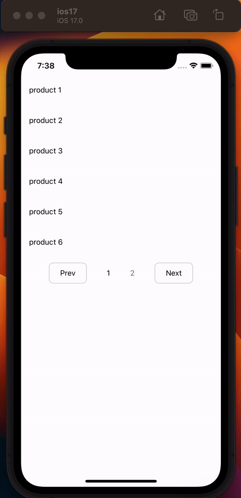
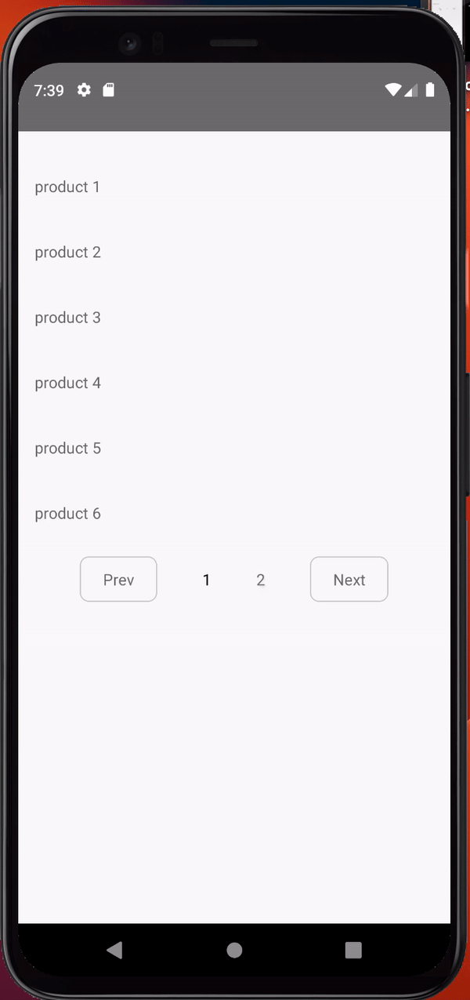

# React Native Paginator

| iOS                            | Android                                |
| ------------------------------ | -------------------------------------- |
|  |  |

## Introduction

React Native Paginator is a simple and customizable pagination component for React Native applications. It enables you to implement easy pagination controls for your lists of data, enhancing the user experience.

### Installation

#### To use RnPaginator in your project, you can install it using npm:

```
npm install rn-paginator
```

### Usage

#### 1. Import the Paginator component into your React Native file:

```
import RnPaginator from 'rn-paginator';
```

#### 2. Use the Paginator component in your React Native component:

```
import React, { useState } from 'react';
import { View, Text, Pressable, StyleSheet, Platform } from 'react-native';
import RnPaginator from 'rn-paginator';

const data = [
  // ... your data array
];

const renderItem = (item) => (
  <View style={{ marginVertical: 20 }} key={item.id}>
    <Text>{item.name}</Text>
  </View>
);

const renderPaginationControl = (text, onPress) => (
  <Pressable style={[styles.btn]} onPress={onPress}>
    <Text>{text}</Text>
  </Pressable>
);

const Home = () => {
  const [show, setShow] = useState([]);

  return (
    <View style={styles.cnt}>
      <View>{show.map(renderItem)}</View>
      <RnPaginator
        data={data}
        itemsPerPage={6}
        renderItem={renderItem}
        renderPaginationControl={renderPaginationControl}
      />
    </View>
  );
};

export default Home;

```

## Props

### React Native Paginator supports the following props:

- `data`: An array of items to be paginated.
- `itemsPerPage`: Number of items to display per page.
- `renderItem`: Function to render each item.
- `renderPaginationControl`: Function to render pagination controls.
- `paginationStyle`: Custom styles for the pagination container.
- `currentPageTextStyle`: Custom styles for the current page number.
- `upcomingPageTextStyle`: Custom styles for the upcoming page number.
- `paginationRootStyle`: Custom styles for the root component.

## Styling

### You can customize the appearance of the Paginator component by modifying the provided styles in the component. Adjust the styles based on your application's design requirements.
